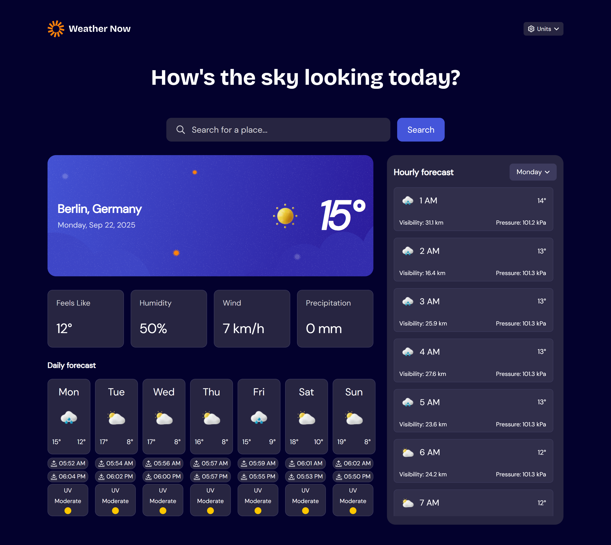
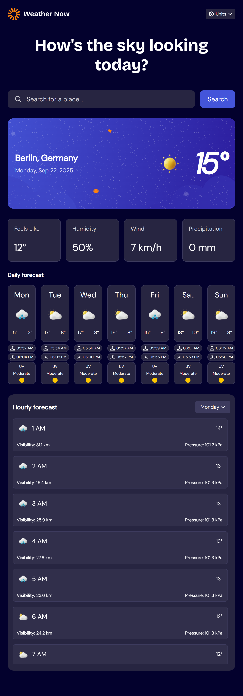
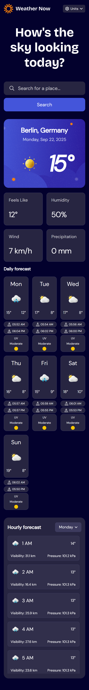

# Frontend Mentor - Weather app solution

This is my solution to the [Weather app challenge on Frontend Mentor](https://www.frontendmentor.io/challenges/weather-app-K1FhddVm49). Frontend Mentor challenges help you improve your coding skills by building realistic projects.

## Table of contents

- [Overview](#overview)
  - [The challenge](#the-challenge)
  - [Screenshot](#screenshot)
  - [Links](#links)
- [Getting Started](#getting-started)
  - [Built with](#built-with)
  - [Useful resources](#useful-resources)
- [Author](#author)

## Overview

### The challenge

Users should be able to:

- Search for weather information by entering a location in the search bar
- View current weather conditions including temperature, weather icon, and location details
- See additional weather metrics like "feels like" temperature, humidity percentage, wind speed, and precipitation amounts
- Browse a 7-day weather forecast with daily high/low temperatures and weather icons
- View an hourly forecast showing temperature changes throughout the day
- Switch between different days of the week using the day selector in the hourly forecast section
- Toggle between Imperial and Metric measurement units via the units dropdown
- Switch between specific temperature units (Celsius and Fahrenheit) and measurement units for wind speed (km/h and mph) and precipitation (millimeters) via the units dropdown
- View the optimal layout for the interface depending on their device's screen size
- See hover and focus states for all interactive elements on the page

### Screenshot

<table>
 <tr>
    <th>Desktop</th>
    <th>Tablet</th>
    <th>Mobile</th>
  </tr>
  <tr>
    <td></td>
    <td></td>
    <td></td>
  </tr>
</table>

### Links

- Solution URL: [Link](https://github.com/olaide-hok/weather-app)
- Live Site URL: [Link](https://weather-app-teal-eight-61.vercel.app/)

## Getting Started

First clone the repository `git clone https://github.com/olaide-hok/weather-app.git`

Change directory into the cloned folder `cd weather-app`

Run `npm install` to install dependencies.

Then, run the development server:

```bash
npm run dev
# or
yarn dev
# or
pnpm dev
# or
bun dev
```

Open [http://localhost:3000](http://localhost:3000) with your browser to see the result.

### Built with

- Semantic HTML5 markup
- CSS custom properties
- Flexbox
- CSS Grid
- Mobile-first workflow
- [React](https://reactjs.org/) - JS library
- [Next.js](https://nextjs.org/) - React framework
- [Tailwind CSS](https://tailwindcss.com/) - For styles

### Useful resources

- [Next.js Documentation](https://nextjs.org/docs) - learn about Next.js features and API.
- [Learn Next.js](https://nextjs.org/learn) - an interactive Next.js tutorial.
- [React Testing Library](https://testing-library.com/docs/react-testing-library/intro/) - The React Testing Library is a very light-weight solution for testing React components.
- [Vitest](https://vitest.dev/guide/) - A testing framework powered by Vite.

## Author

- Website - [Habeeb Kareem](https://habeeb-dev.netlify.app)
- Frontend Mentor - [@olaide-hok](https://www.frontendmentor.io/profile/olaide-hok)
